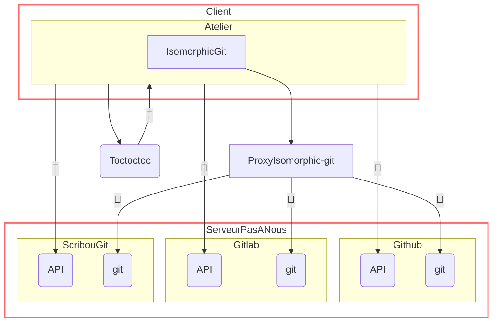
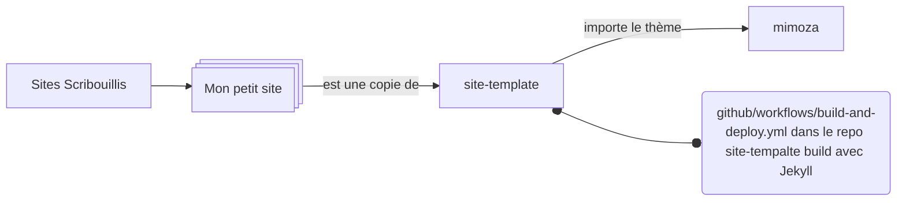

# Intention

0/ Permettre à des non-informaticiennes

- de créer un petit site rapidement / facilement
- avoir une relation saine et sereine avec son contenu

1/ Liste des dépots de code

- [Scribouilli](https://github.com/Scribouilli/scribouilli) code source de l'atelier (client)
- [toctoctoc](https://github.com/Scribouilli/toctoctoc) outil d'authentification github, gitlab et scribougit (serveur)
- [site-template](https://github.com/Scribouilli/site-template) base de scribouilli pour démarrer un site
- [mimoza](https://github.com/Scribouilli/mimoza) thème de base pour le site généré par Scribouilli
- [documentation](https://github.com/Scribouilli/documentation) page du site explicatif de scriboulli (https://scribouilli.org/)
- [.github](https://github.com/Scribouilli/.github) le dépot où est enregistré ce fichier README.md

Il y aussi des dépots spécifique pour Framalibre
- [site-template-framalibre](https://github.com/Scribouilli/site-template-framalibre)
- [kabusin](https://github.com/Scribouilli/kabusin)

Et pour la campagne legislative de 2024
- [roz-aer](https://github.com/Scribouilli/roz-aer)
- [Scribouilli2024](https://github.com/Scribouilli/scribouilli2024)
- [site-template-2024](https://github.com/Scribouilli/site-template-2024)
- [toctoctoc2024](https://github.com/Scribouilli/toctoctoc2024)

2/ Schéma d'interaction des composants de Scribouilli

3/

